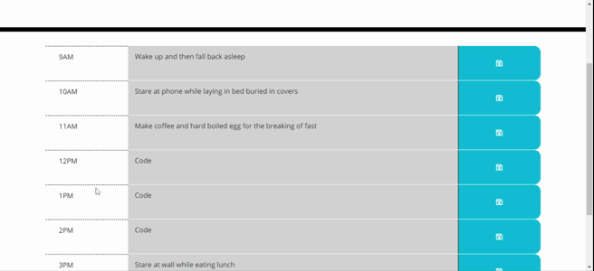
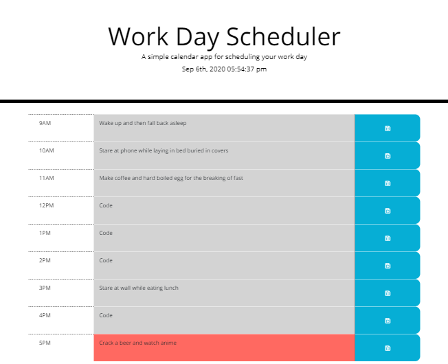

# Daily Calendar Application :speech_balloon:	:clock930:	

Here is a direct and working URL to my daily planner application!

[Click here for the daily planner/calendar!](https://cat-lin-morgan.github.io/daily-calendar/ "Cat's Daily Planner")

## Acceptance Criteria

A daily planner!

When you open it the date and time are located at the top.
I made the clock actually work cause it was an experiment to see if I could. 

Each block is colorcoated depending on the time of day. With the present time being red, past grey, and future green. :bookmark_tabs:	

When you click on the time block you can enter a plan. 

When you click on the save button it saves them to local storage. :floppy_disk:	

You can save and refresh the page and the plans are still there. :date:	

Below is a gif of the application in action!
A still screenshot is below that.

---

**Thank you for viewing.**:toilet:	

